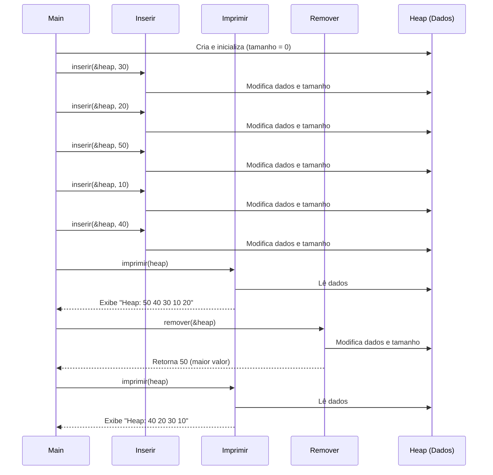

# 🧠 Estrutura de Dados: Heap (Max-Heap e Min-Heap)

Este repositório contém explicações e exemplos sobre a estrutura de dados **Heap**, abordando as variações **Max-Heap** e **Min-Heap**, e sua aplicação no algoritmo de ordenação **Heap Sort**.

---

## 📚 O que é um Heap?

Um **Heap** é uma **árvore binária completa** usada para organizar dados de forma que o elemento mais importante (maior ou menor) esteja sempre na **raiz**.

Embora conceitualmente seja uma árvore, ela é normalmente **implementada com vetores** por causa de sua estrutura completa e fácil cálculo de posições dos filhos e do pai.

---

## 🔁 Regras do Heap

### ✅ Max-Heap
- O valor da **raiz** é sempre o **maior** do heap.
- Cada **nó pai** é **maior ou igual** aos seus filhos.
- Usado quando precisamos acessar rapidamente o **maior elemento**.

### ✅ Min-Heap
- O valor da **raiz** é sempre o **menor** do heap.
- Cada **nó pai** é **menor ou igual** aos seus filhos.
- Usado quando precisamos acessar rapidamente o **menor elemento**.

---

## 🧠 Heap é um algoritmo de ordenação?

**Não exatamente.**  
Heap é uma **estrutura de dados**.

Porém, existe um **algoritmo de ordenação chamado Heap Sort**, que **usa um heap (geralmente Max-Heap)** para ordenar dados.

---

## 📊 Diferença no uso com Heap Sort

| Tipo de Heap | Resultado da ordenação |
|--------------|-------------------------|
| Max-Heap     | Ordem crescente         |
| Min-Heap     | Ordem decrescente       |

---

## 🧪 Como funciona a implementação?

- O Heap é armazenado em um **vetor**.
- Para cada elemento na posição `i`:
  - Filho esquerdo: `2*i + 1`
  - Filho direito: `2*i + 2`
  - Pai: `(i - 1) / 2`

---

## ✅ Operações básicas

### Inserção
- Insere o novo elemento no final do vetor.
- "Sobe" ele até manter a propriedade do heap.

### Remoção (extração da raiz)
- Substitui a raiz pelo último elemento.
- "Desce" esse elemento até restaurar a propriedade do heap.

---

## 🆚 Diferenças: Árvore Binária vs. Árvore de Busca Binária vs. Heap Binário

É comum confundir esses termos, mas eles têm propósitos e regras distintas:

1.  **🌳 Árvore Binária (Binary Tree):**
    *   **Estrutura:** Cada nó tem no máximo dois filhos (um esquerdo e um direito).
    *   **Ordem:** Nenhuma regra específica sobre os valores dos nós.
    *   **Completude:** Não precisa ser completa.
    *   **Principal Característica:** É a estrutura base para as outras.

2.  **🔍 Árvore de Busca Binária (Binary Search Tree - BST):**
    *   **Estrutura:** É uma árvore binária.
    *   **Ordem (Propriedade de Busca):**
        *   Valores na subárvore esquerda são **menores** que o nó pai.
        *   Valores na subárvore direita são **maiores** que o nó pai.
    *   **Completude:** Não precisa ser completa.
    *   **Principal Característica:** Otimizada para buscas rápidas (em média).

3.  **堆 Heap Binário (Binary Heap):**
    *   **Estrutura:** É uma **árvore binária completa** (todos os níveis preenchidos, exceto talvez o último, que é preenchido da esquerda para a direita).
    *   **Ordem (Propriedade do Heap):**
        *   **Max-Heap:** O pai é sempre **maior ou igual** aos filhos. O maior elemento está na raiz.
        *   **Min-Heap:** O pai é sempre **menor ou igual** aos filhos. O menor elemento está na raiz.
    *   **Completude:** Deve ser completa.
    *   **Principal Característica:** Otimizada para obter rapidamente o maior (Max-Heap) ou menor (Min-Heap) elemento. Usada em filas de prioridade e algoritmos de ordenação como o Heap Sort.

**Em resumo:**
*   **Árvore Binária:** Apenas a estrutura de dois filhos.
*   **Árvore de Busca Binária:** Estrutura + Ordem para busca eficiente.
*   **Heap Binário:** Estrutura completa + Ordem para acesso rápido ao extremo (máximo/mínimo).

## 📌 Heap Sort

O **Heap Sort** é um algoritmo de ordenação baseado na estrutura de heap, especialmente no **Max-Heap**.

### 🔄 Funcionamento

1. **Construção do Max-Heap**: reorganiza o vetor original para que ele satisfaça a propriedade de Max-Heap.
2. **Ordenação**:
   - Troca o primeiro elemento (maior) com o último.
   - Reduz o tamanho considerado do heap.
   - Reorganiza o heap para manter a propriedade max-heap.

Esse processo se repete até que o vetor esteja ordenado.

### 🧠 Exemplo:

Dado o vetor `[4, 10, 3, 5, 1]`:

1. Constrói Max-Heap → `[10, 5, 3, 4, 1]`
2. Troca 10 com 1 → `[1, 5, 3, 4, 10]`
3. Reorganiza o heap → `[5, 4, 3, 1, 10]`
4. Repete até o vetor estar totalmente ordenado

## 📈 Diagrama de Sequência (Exemplo da `main`)

O diagrama abaixo ilustra a sequência de chamadas de função na `main` presente em `max_heap.c`:

---
