# 🧠 Estrutura de Dados: Heap (Max-Heap e Min-Heap)

Este repositório contém explicações e exemplos sobre a estrutura de dados **Heap**, abordando as variações **Max-Heap** e **Min-Heap**, e sua aplicação no algoritmo de ordenação **Heap Sort**.

---

## 📚 O que é um Heap?

Um **Heap** é uma **árvore binária completa** usada para organizar dados de forma que o elemento mais importante (maior ou menor) esteja sempre na **raiz**.

Embora conceitualmente seja uma árvore, ela é normalmente **implementada com vetores** por causa de sua estrutura completa e fácil cálculo de posições dos filhos e do pai.

---

## 🔁 Regras do Heap

### ✅ Max-Heap
- O valor da **raiz** é sempre o **maior** do heap.
- Cada **nó pai** é **maior ou igual** aos seus filhos.
- Usado quando precisamos acessar rapidamente o **maior elemento**.

### ✅ Min-Heap
- O valor da **raiz** é sempre o **menor** do heap.
- Cada **nó pai** é **menor ou igual** aos seus filhos.
- Usado quando precisamos acessar rapidamente o **menor elemento**.

---

## 🧠 Heap é um algoritmo de ordenação?

**Não exatamente.**  
Heap é uma **estrutura de dados**.

Porém, existe um **algoritmo de ordenação chamado Heap Sort**, que **usa um heap (geralmente Max-Heap)** para ordenar dados.

---

## 📊 Diferença no uso com Heap Sort

| Tipo de Heap | Resultado da ordenação |
|--------------|-------------------------|
| Max-Heap     | Ordem crescente         |
| Min-Heap     | Ordem decrescente       |

---

## 🧪 Como funciona a implementação?

- O Heap é armazenado em um **vetor**.
- Para cada elemento na posição `i`:
  - Filho esquerdo: `2*i + 1`
  - Filho direito: `2*i + 2`
  - Pai: `(i - 1) / 2`

---

## ✅ Operações básicas

### Inserção
- Insere o novo elemento no final do vetor.
- "Sobe" ele até manter a propriedade do heap.

### Remoção (extração da raiz)
- Substitui a raiz pelo último elemento.
- "Desce" esse elemento até restaurar a propriedade do heap.

---

## 🆚 Diferenças: Árvore Binária vs. Árvore de Busca Binária vs. Heap Binário

É comum confundir esses termos, mas eles têm propósitos e regras distintas:

1.  **🌳 Árvore Binária (Binary Tree):**
    *   **Estrutura:** Cada nó tem no máximo dois filhos (um esquerdo e um direito).
    *   **Ordem:** Nenhuma regra específica sobre os valores dos nós.
    *   **Completude:** Não precisa ser completa.
    *   **Principal Característica:** É a estrutura base para as outras.

2.  **🔍 Árvore de Busca Binária (Binary Search Tree - BST):**
    *   **Estrutura:** É uma árvore binária.
    *   **Ordem (Propriedade de Busca):**
        *   Valores na subárvore esquerda são **menores** que o nó pai.
        *   Valores na subárvore direita são **maiores** que o nó pai.
    *   **Completude:** Não precisa ser completa.
    *   **Principal Característica:** Otimizada para buscas rápidas (em média).

3.  **堆 Heap Binário (Binary Heap):**
    *   **Estrutura:** É uma **árvore binária completa** (todos os níveis preenchidos, exceto talvez o último, que é preenchido da esquerda para a direita).
    *   **Ordem (Propriedade do Heap):**
        *   **Max-Heap:** O pai é sempre **maior ou igual** aos filhos. O maior elemento está na raiz.
        *   **Min-Heap:** O pai é sempre **menor ou igual** aos filhos. O menor elemento está na raiz.
    *   **Completude:** Deve ser completa.
    *   **Principal Característica:** Otimizada para obter rapidamente o maior (Max-Heap) ou menor (Min-Heap) elemento. Usada em filas de prioridade e algoritmos de ordenação como o Heap Sort.

**Em resumo:**
*   **Árvore Binária:** Apenas a estrutura de dois filhos.
*   **Árvore de Busca Binária:** Estrutura + Ordem para busca eficiente.
*   **Heap Binário:** Estrutura completa + Ordem para acesso rápido ao extremo (máximo/mínimo).

---

## 🛠️ Exemplos de Usos para Heap Binário

A estrutura de dados **heap binário** é amplamente utilizada em várias áreas da computação por causa de sua eficiência na manipulação de **valores com prioridades**. Abaixo estão exemplos práticos e reais de **usos do heap binário**:

---

### ✅ 1. **Filas de prioridade (Priority Queue)**
- **Descrição:** permite inserir elementos com prioridade e extrair o de maior (ou menor) prioridade rapidamente.
- **Aplicações práticas:**
  - Sistemas operacionais (agendamento de processos).
  - Gerenciamento de tarefas em jogos.
  - Simuladores de eventos (por exemplo, em redes ou linhas de produção).

---

### ✅ 2. **Heap Sort**
- **Descrição:** algoritmo de ordenação baseado em heap binário (geralmente Max-Heap).
- **Aplicações práticas:**
  - Ordenação de grandes volumes de dados quando não se pode usar muita memória extra (é in-place).
  - Situações que exigem desempenho consistente com complexidade `O(n log n)`.

---

### ✅ 3. **Algoritmo de Dijkstra**
- **Descrição:** encontra o caminho mais curto de um ponto a outro em grafos ponderados.
- **Uso do heap:** Min-Heap é usado para obter o próximo vértice com a menor distância.
- **Aplicações práticas:**
  - GPS e mapas (Google Maps, Waze).
  - Roteamento de pacotes em redes.

---

### ✅ 4. **Algoritmo de Kruskal**
- **Descrição:** usado para encontrar a **árvore geradora mínima** de um grafo.
- **Uso do heap:** fila de prioridade para ordenar arestas por peso.
- **Aplicações práticas:**
  - Otimização de redes de energia, estradas, redes de computadores.

---

### ✅ 5. **Simulação de eventos futuros**
- **Descrição:** agenda eventos em ordem de tempo crescente.
- **Uso do heap:** Min-Heap com base na hora programada do evento.
- **Aplicações práticas:**
  - Simulações em tempo real (linhas de produção, elevadores).
  - Jogos baseados em eventos (RTS, jogos de simulação).

---

### ✅ 6. **Mesclagem de k listas ordenadas (k-way merge)**
- **Descrição:** eficiente para unir várias listas ordenadas.
- **Uso do heap:** Min-Heap para sempre escolher o menor valor entre os primeiros de cada lista.
- **Aplicações práticas:**
  - Implementação do **Merge Sort Externo** (quando os dados não cabem na RAM).
  - Sistemas de busca (como Google) que combinam resultados de vários servidores.

---

### ✅ 7. **Autocompletar e ranking em sistemas de busca**
- **Descrição:** para mostrar os **top-N resultados** mais relevantes.
- **Uso do heap:** Min-Heap para manter os `N` melhores resultados em tempo real.
- **Aplicações práticas:**
  - Motores de busca.
  - E-commerces (mostrar produtos mais populares).

---

## 📌 Heap Sort

O **Heap Sort** é um algoritmo de ordenação baseado na estrutura de heap, especialmente no **Max-Heap**.

### 🔄 Funcionamento

1. **Construção do Max-Heap**: reorganiza o vetor original para que ele satisfaça a propriedade de Max-Heap.
2. **Ordenação**:
   - Troca o primeiro elemento (maior) com o último.
   - Reduz o tamanho considerado do heap.
   - Reorganiza o heap para manter a propriedade max-heap.

Esse processo se repete até que o vetor esteja ordenado.

### 🧠 Exemplo:

Dado o vetor `[4, 10, 3, 5, 1]`:

1. Constrói Max-Heap → `[10, 5, 3, 4, 1]`
2. Troca 10 com 1 → `[1, 5, 3, 4, 10]`
3. Reorganiza o heap → `[5, 4, 3, 1, 10]`
4. Repete até o vetor estar totalmente ordenado

## 📈 Diagrama de Sequência (Exemplo da `main`)

O diagrama abaixo ilustra a sequência de chamadas de função na `main` presente em `max_heap.c`:

```mermaid
sequenceDiagram
    participant main as Main
    participant inserir as Inserir
    participant imprimir as Imprimir
    participant remover as Remover
    participant heap as Heap (Dados)

    main->>heap: Cria e inicializa (tamanho = 0)
    main->>inserir: inserir(&heap, 30)
    inserir->>heap: Modifica dados e tamanho
    main->>inserir: inserir(&heap, 20)
    inserir->>heap: Modifica dados e tamanho
    main->>inserir: inserir(&heap, 50)
    inserir->>heap: Modifica dados e tamanho
    main->>inserir: inserir(&heap, 10)
    inserir->>heap: Modifica dados e tamanho
    main->>inserir: inserir(&heap, 40)
    inserir->>heap: Modifica dados e tamanho
    
    main->>imprimir: imprimir(heap)
    imprimir->>heap: Lê dados
    imprimir-->>main: Exibe "Heap: 50 40 30 10 20"

    main->>remover: remover(&heap)
    remover->>heap: Modifica dados e tamanho
    remover-->>main: Retorna 50 (maior valor)
    main->>imprimir: imprimir(heap)
    imprimir->>heap: Lê dados
    imprimir-->>main: Exibe "Heap: 40 20 30 10"
```

---
